# Wild Oasis Hotel Management System

Time：Oct - Nov. 2023  
**Visit the App: [wild-oasis-hotel-system](https://wo-hotel-system-aorui.vercel.app/)**

## Overview

### Project Purpose

This project is a custom application for hotel resource and booking management, specifically designed for internal use by hotel administrators. With almost 40 reusable UI components and over 35 feature components, it features comprehensive management modules for bookings, guests, cabins, and check-in/check-out processes, complemented by an integrated business dashboard. Additionally, the application supports system settings and user authentication functionalities, including login, sign-up, and logout, tailored to the hotel's business operations.

### My role

As the developer of this full-stack web app, I am responsible for implementing the application's functionalities, guided by Jonas's design framework. The project's backend including database and Apis is developed using Supabase and is deployed on Vercel. I built complicated web app features, ensuring seamless front-end performance.

## Challenges

#### 1. Complicated Remote States Management:

Use `React Query` and `custom Hooks` to call `RESTful APIs` for hotel resources including Cabins, Bookings and Guests, including query, update, delete, sort and filter these resources.

#### 2. User Authentication and Authorisation:

Protect hotel data and resources using `RLS(Row Level Security)` policies and enable users to log in, log out, sign up new user and update user credentials.

#### 3. Comprehensive Dashboard Building:

Use `Recharts` library to build informative graphs and charts.

#### 4. Intuitive and accessible User Experience:

`Prefetch data` to ensure seamless pagination, employ `Error Boundary` and React Query for efficient `error handling` and to manage `loading status` effectively and build visually appealing `dark mode` to meet various needs.

## Technologies Used

This is a Single-Page Application(SPA) based on `REACT`, `Javascript`, `JSX`, `HTML5` and `CSS3` and any other relevant tools (Supabase, Git, Vite, Vercel, etc.).

| Tasks                   | Tech Decisions                                                                          |
| ----------------------- | --------------------------------------------------------------------------------------- |
| Routing                 | React Router                                                                            |
| Styling                 | Styled Components                                                                       |
| Remote State Management | React Query                                                                             |
| UI State Management     | Context API                                                                             |
| Form Management         | React Hook Form                                                                         |
| Other tools             | React icons, React hot toast,Recharts, data-fns, Supabase, Vite, Vercel, Git and Github |

## Features

**1. User Authentication**

- User Sign up
- User Log in
- User Log out
  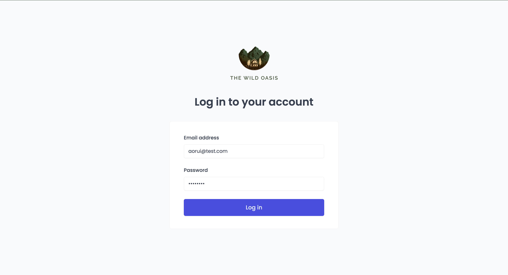
  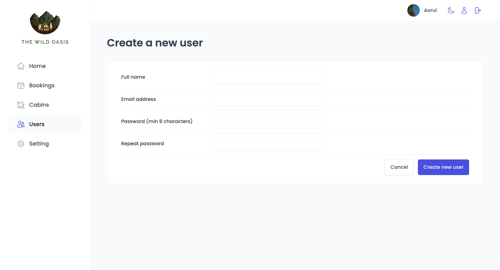

**2. Dashboard**

- Key performance indicators statistics
- Todays check-in and check-out activities
- Stay duration distribution
- Bookings trend
- Filter  
  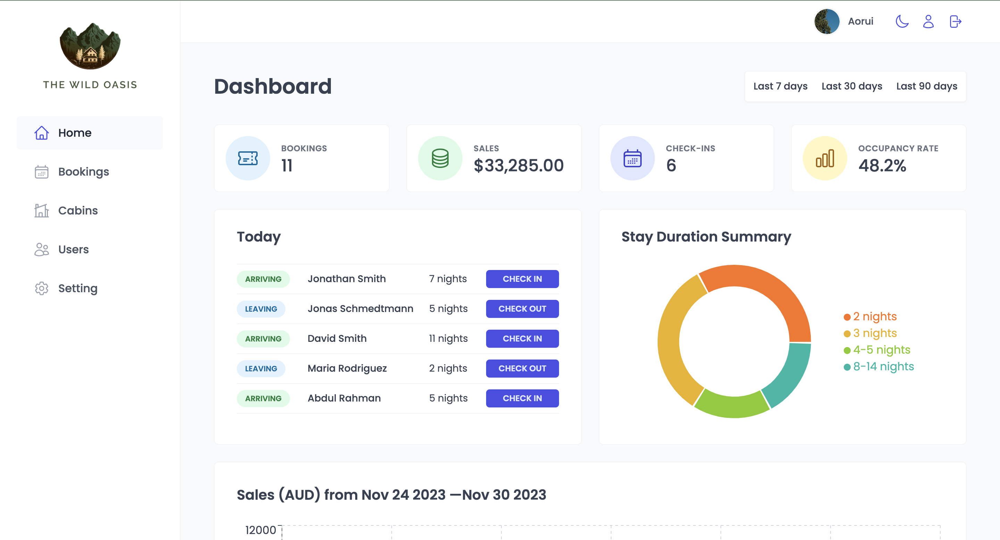
  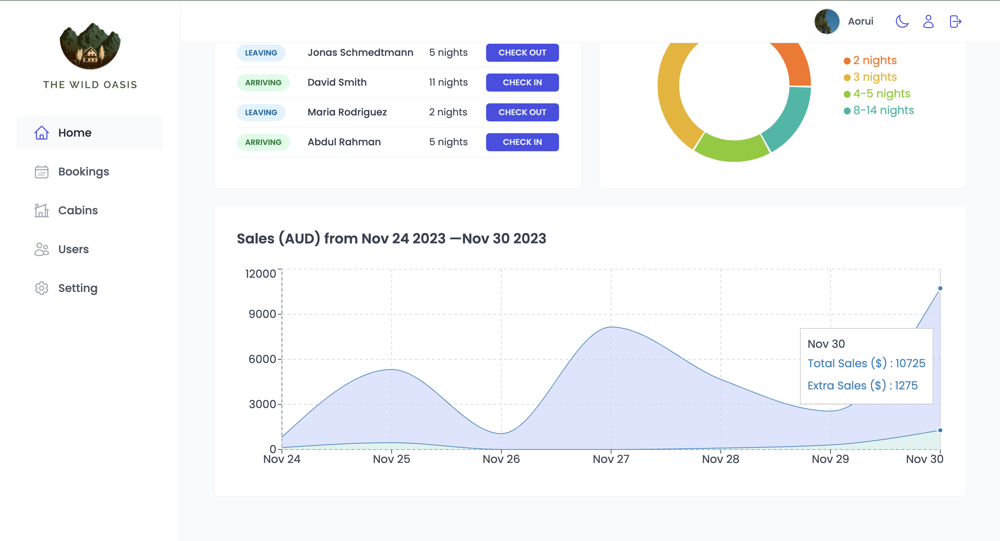

**3. Cabins Management**

- Cabins list
- Create Cabin data
- Upload image file
- Delete Cabin data
- Update Cabin data
- Duplicate Cabin date
- Filter
- Sort
- Pagination
  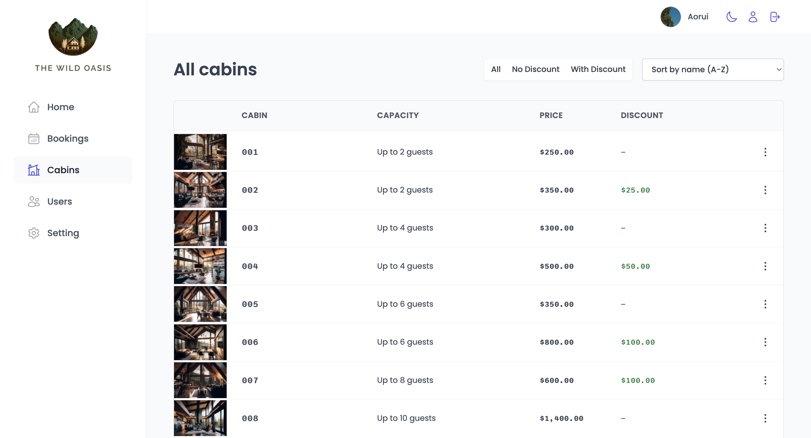
  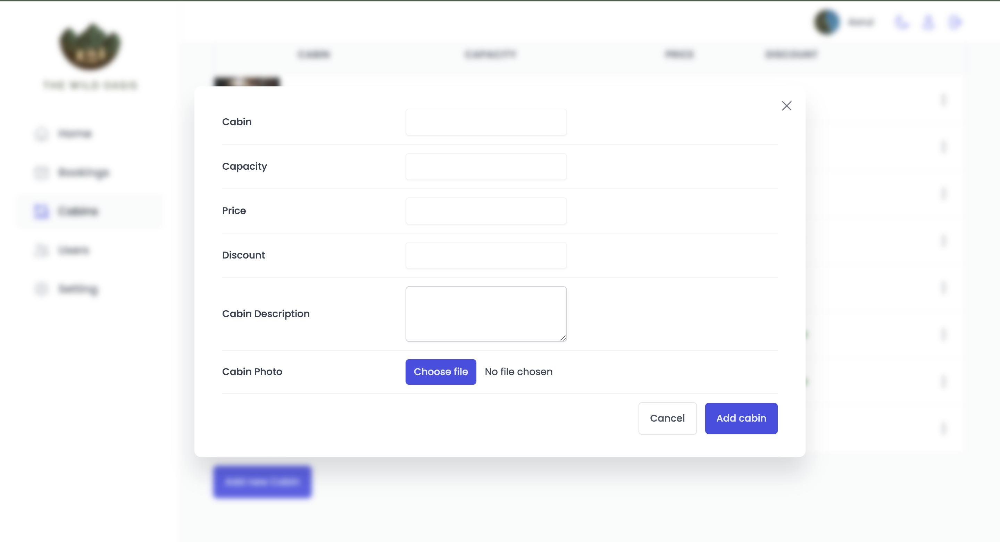
  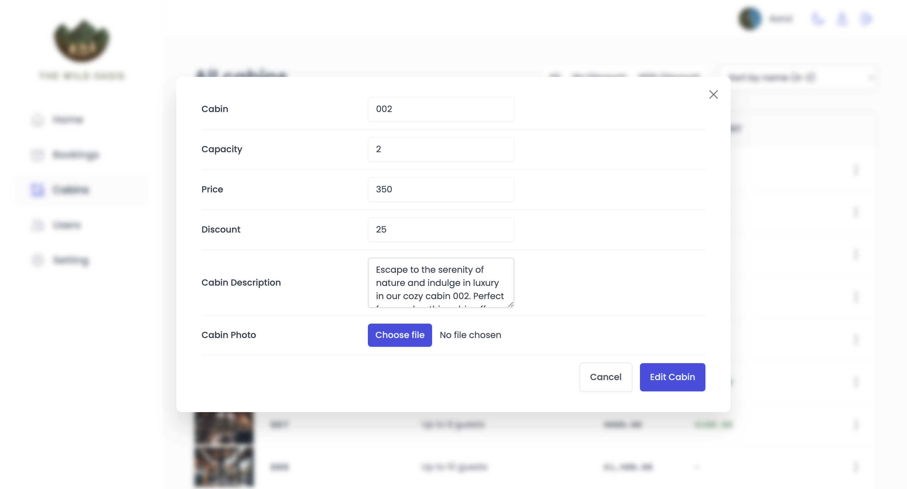

**4. Bookings Management**

- Bookings list
- Booking details
- Delete Booking data
- Filter
- Sort
- Pagination  
  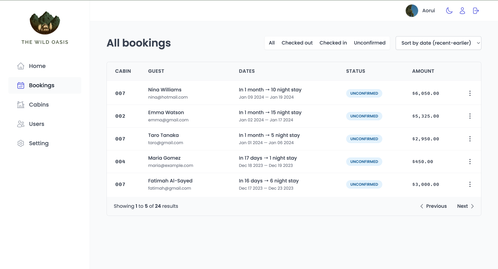
  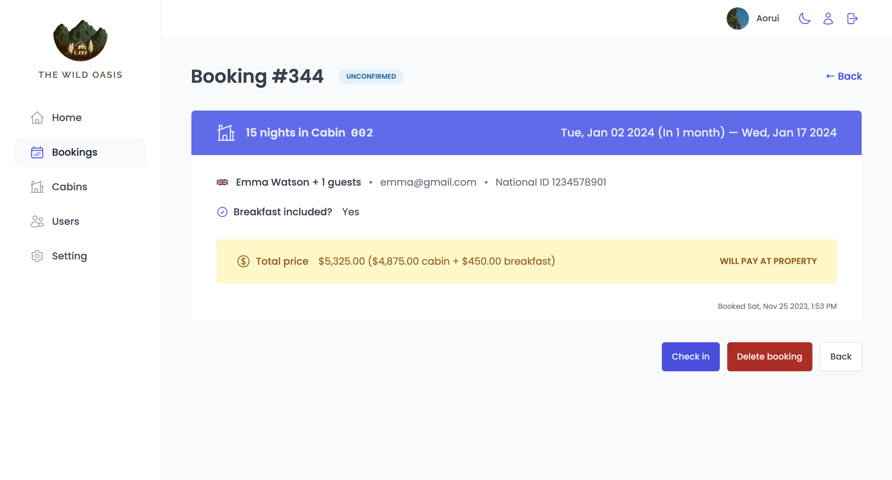

**5. Check-in/Check-out**

- Check in unconfirmed booking
- Add breakfash when check in
- Check out booking  
  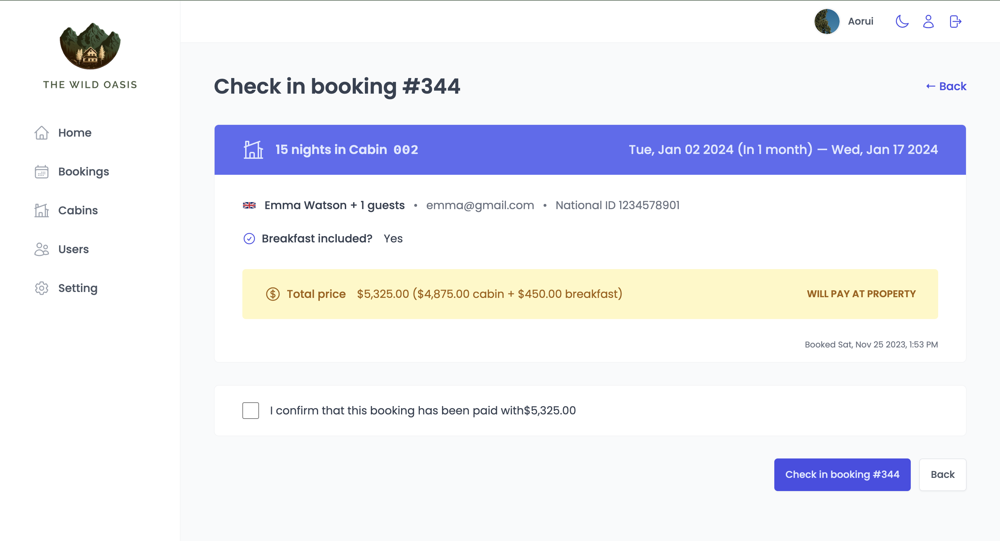
  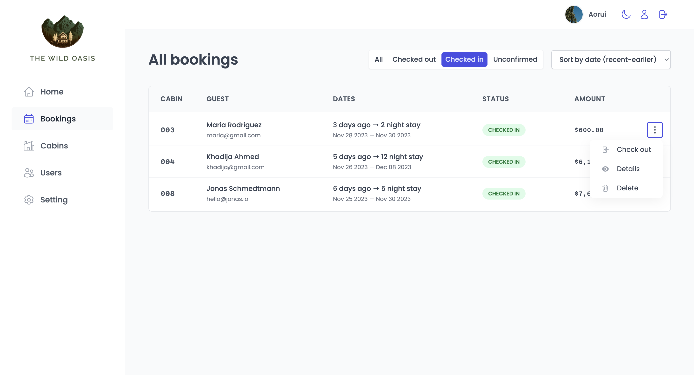

**6. Dark Mode**

- dark mode for the whole App

  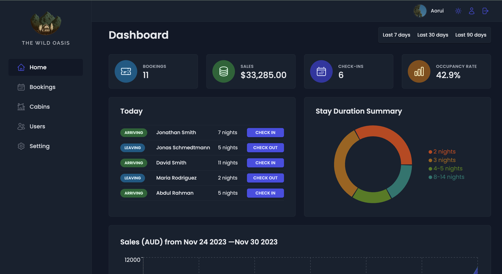
  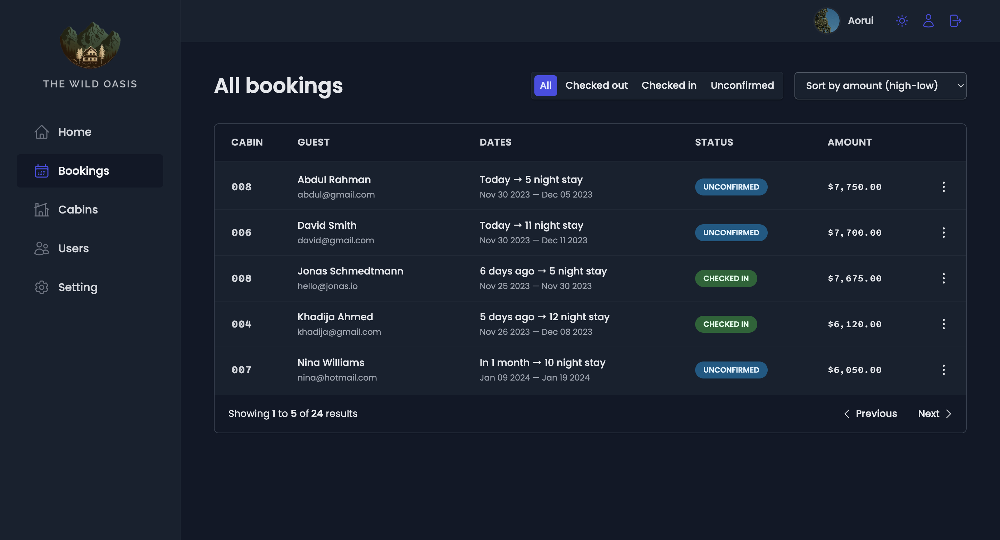

**7. Settings**

- change settings for order

  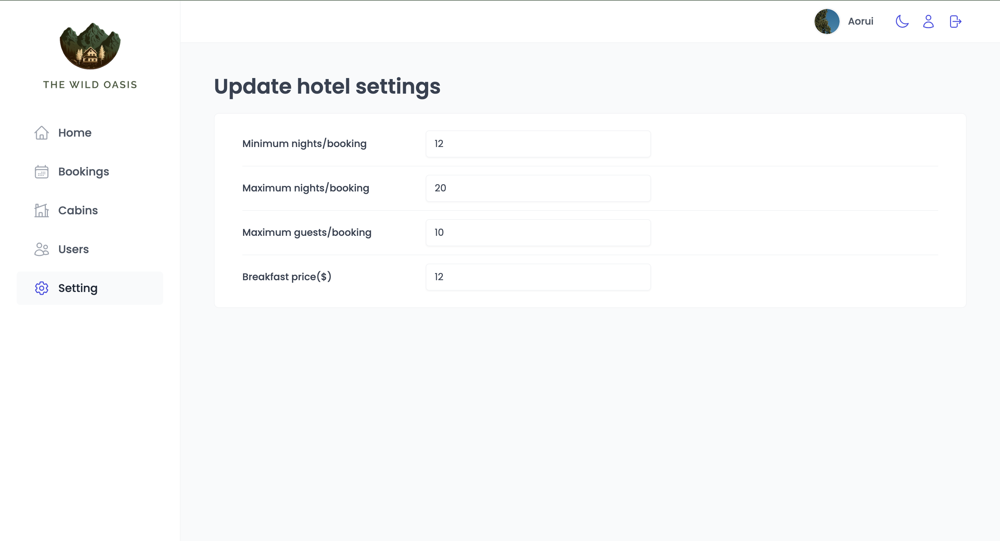

### How to run the code

Visit the web app [here](https://wo-hotel-system-aorui.vercel.app/).

1. Download project files
2. Run `npm i` to install the npm packages
3. Run `npm run dev`
4. Visit `http://localhost:5173/`

## Suggestions and Feedbacks

Let me know if you have any comments or feedbacks to make this project better!
